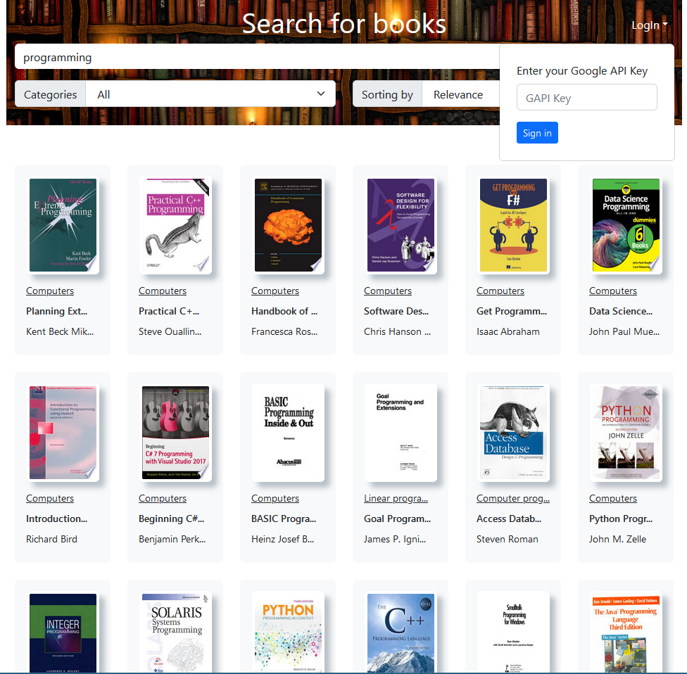
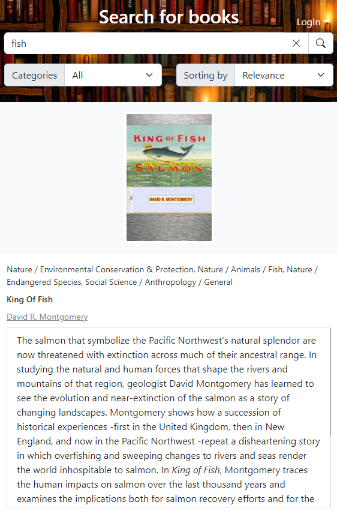
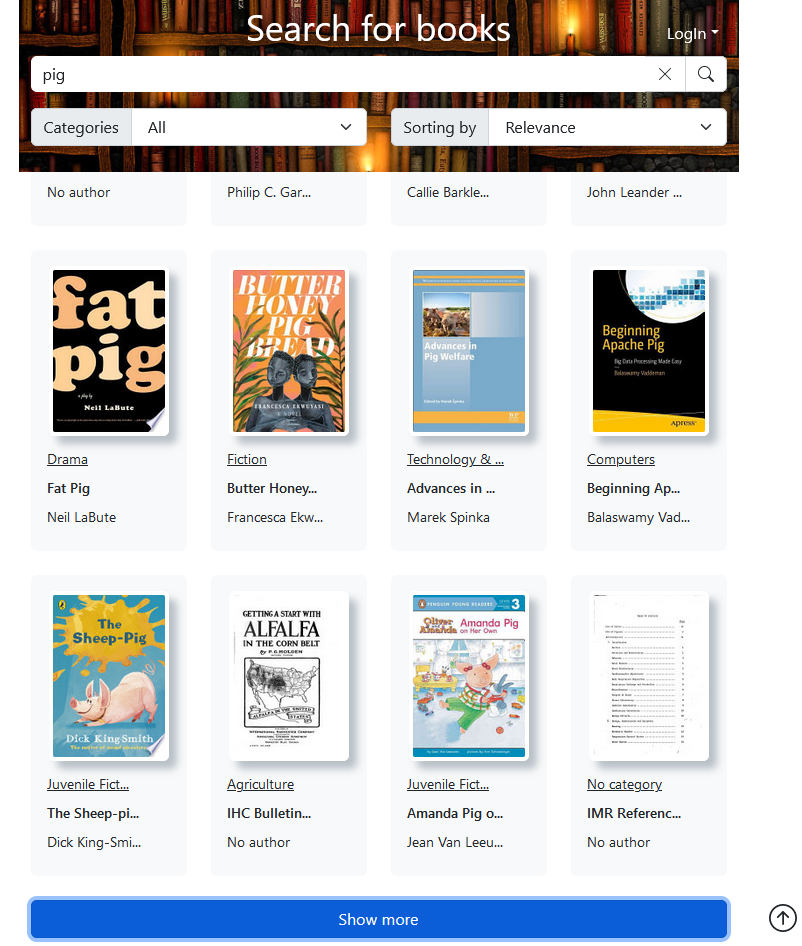

# Поисковик книг для Google Books API

## Доступные скрипты

Для запуска приложения, в директории проекта выполните следующие команды:

### Установка всех зависимостей:
>### `npm install`

### Запуск самого приложения:
>### `npm start`

### Создать Docker контейнер:
>### `docker build .`

### Запустить Docker контейнер:
>### `docker run -d -p 3000:80 <image_id>`
 

## Это React SPA приложение в виде поисковика книг, для открытого [Google API](https://developers.google.com/books/docs/v1/using).

### Приложение написано с использованием TypeScript и обладает следующей функциональностью:
1. Ходит на Google Books API с помощью асинхронных Санок из RTK (createAsyncThunk). Санки под капотом используют Axios. Состояние хранится в Redux store
2. Приложение можно сбилдить в Docker container и запустить.
3. В SPA есть строка запроса для ввода названия, фильтр по категориям и сотрировка.

4. При клике на картинку карточки каталога, открывается расширенная карточка каталога.

5. Приложение реагирует на изменение размеров.

6. SPA использует синхронизацию store и localStorage с помощью redux-persist.
7. Используется react-popper-tooltip, при наведении на сокращенные названия в карточке каталога, в течении секунды появится ToolTip с полным описание.
8. Для стилизации используется Bootstrap 5.
9. Пагинация происходит посредством Show more button.
10. При прокрутке страницы вниз на некоторое кол-во пикселей, появляется кнопка ScrollTop

